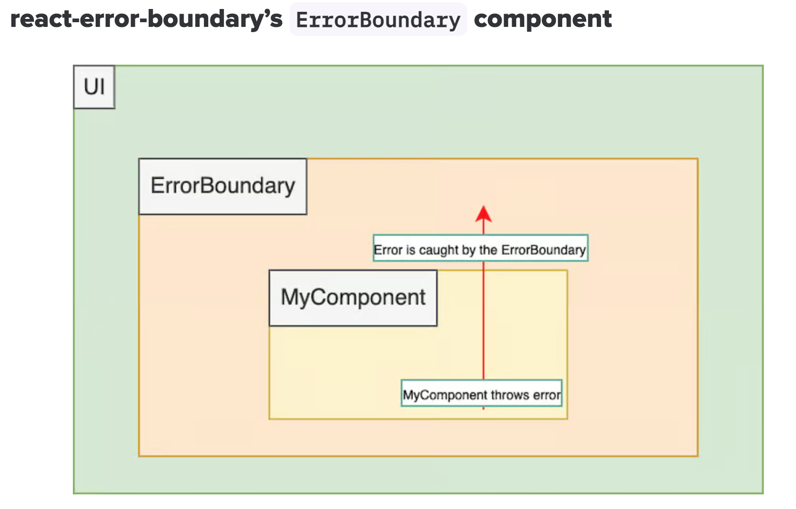

# React Error Boundaries

## Installation

```bash
pnpm add react-error-boundary
```

## Example

React Error Boundary is a component that catches specific errors in its child component tree and renders a fallback UI instead of crashing the whole app.




> In terms of where to place these error boundaries, they can be set up around the entire app or individual components for more granular control. It’s important to note that error boundaries catch errors during rendering, in lifecycle methods, and in constructors of the whole tree below them. However, error boundaries do not catch errors for:

 1. Event handlers (for that, you need to use regular try/catch)
 2. Asynchronous code (e.g., setTimeout or requestAnimationFrame callbacks)
 3. Server-side rendering 
 4. Errors thrown in the error boundary itself (rather than in its children)

 > -- <cite>[Log Rocket](https://blog.logrocket.com/react-error-handling-react-error-boundary/)</cite>


For our application, we choose to structure at least one error boundary per route. This way, we can provide a more user-friendly experience when an error occurs. 

However, as our app grows more complex, we may need to add more error boundaries within specific nested components. 

As a simple example of how to use an error boundary, we can create a component that catches errors and displays a fallback UI:

```tsx
const LandingFallBack = ({ error }: FallbackProps) => {
  return (
    <FlexColumn padding={10} spacing={5}>
      <Typography variant="h5" color="error">
        Something went wrong: {error.message}
      </Typography>

      <Button
        variant="contained"
        color="primary"
        sx={{ width: 200 }}
        onClick={() => window.location.reload()}
      >
        Reload Page
      </Button>
    </FlexColumn>
  );
};

export const LandingRoute = () => {
  return (
    <ErrorBoundary
      FallbackComponent={LandingFallBack}
      onReset={() => window.location.reload()}
    >
      <LandingView />;
    </ErrorBoundary>
  );
};
```

In this example, we have a `LandingRoute` component that wraps the `LandingView` component with an `ErrorBoundary`. If an error occurs in the `LandingView` component, the `ErrorBoundary` will catch the error and render the `LandingFallBack` component instead.