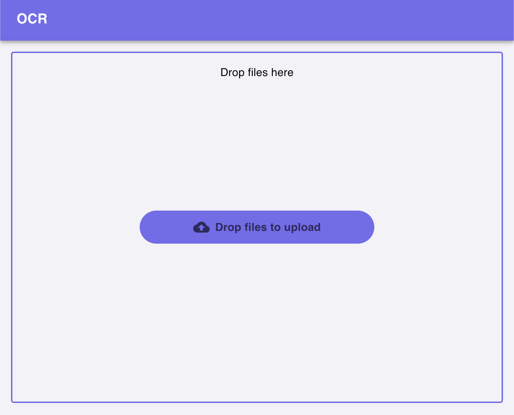

# MUI

## Configuration

### Installation

For a [default installation](https://mui.com/material-ui/getting-started/installation/), run the following command:

```bash
pnpm add @mui/material @emotion/react @emotion/styled
```

*You may need to add a -w flag to add the package to your workspace root.*

Thats it! You are ready to start using MUI.

### Theme 

In your `src/library/` directory, create a new file called `theme.ts`. This file will house your custom theme. If you don't have a good theme in mind, I would checkout out [Coolors](https://coolors.co/).

Start by create a theme object: 
    
```ts
export const themeColors = {
    background: '#f2f2f7',
    white: '#ffffff',
    black: '#08080a',
    brand: {
        slateBlue: '#736CED',
        tropicalIndigo: '#9F9FED',
        thistle: '#D4C1EC',
        champagnePink: '#F2DFD7',
        spaceCadet: '#2E294E',
    }
}
```

Next, create a [theme object](https://mui.com/material-ui/customization/theming/) that uses the colors you defined:

```ts
import { createTheme } from '@mui/material/styles';

export const themeColors = { ... }

export const theme = createTheme({
    palette: {
        primary: {
            main: themeColors.brand.slateBlue,
            light: themeColors.brand.thistle,
            dark: themeColors.brand.spaceCadet,
        },
        secondary: {
            main: themeColors.brand.tropicalIndigo,
        },
        background: {
            default: themeColors.background,
            paper: themeColors.white,
        },
        text: {
            primary: themeColors.black,
        },
    },
    typography: {
        fontFamily: 'Inter, sans-serif',
    },
});
```

Now, you can use the `ThemeProvider` to apply the theme to your application:

```tsx
import { ThemeProvider } from "@mui/material";
import { theme } from "@/lib/theme";

export function AppProvider({ children }: React.PropsWithChildren) {
  return (
      <ThemeProvider theme={theme}>{children}</ThemeProvider>
  );
}
```

IF you want to use both a light and dark theme, as well as let mui handle the toggling, you can use the `createTheme` function to create a theme that supports both:

```ts
import { createTheme } from '@mui/material/styles';

export const lightThemeColors = { ... }
export const darkThemeColors = { ... }

export const theme = createTheme({
  colorSchemes: {
    light: {
      palette: {
        primary: {
          ...
        },
        ...
      },
    },
    dark: {
      palette: {
        primary: {
          ...
        },
        ...
      },
    },
  },
});
```

This allows you to use the `useColorScheme` hook to determine which theme to use:

[Example from Mui](https://mui.com/material-ui/customization/dark-mode/)

```tsx
function MyApp() {
  const { mode, setMode } = useColorScheme();
  if (!mode) {
    return null;
  }
  return (
    <Box
      sx={{
        display: 'flex',
        width: '100%',
        alignItems: 'center',
        justifyContent: 'center',
        bgcolor: 'background.default',
        color: 'text.primary',
        borderRadius: 1,
        p: 3,
        minHeight: '56px',
      }}
    >
      <FormControl>
        <FormLabel id="demo-theme-toggle">Theme</FormLabel>
        <RadioGroup
          aria-labelledby="demo-theme-toggle"
          name="theme-toggle"
          row
          value={mode}
          onChange={(event) =>
            setMode(event.target.value as 'system' | 'light' | 'dark')
          }
        >
          <FormControlLabel value="system" control={<Radio />} label="System" />
          <FormControlLabel value="light" control={<Radio />} label="Light" />
          <FormControlLabel value="dark" control={<Radio />} label="Dark" />
        </RadioGroup>
      </FormControl>
    </Box>
  );
}

const theme = createTheme({
  colorSchemes: {
    dark: true,
  },
});

export default function ToggleColorMode() {
  return (
    <ThemeProvider theme={theme}>
      <MyApp />
    </ThemeProvider>
  );
}
```

## Styling 

### Components

Sometimes, we may wish to style a component in a way that is not possible with the default MUI API. For example, when using a third party library in which their components do not inherently support the `sx` prop (or simply want to abstract the styling away from the direct rendering). In these cases, we can use the `styled` function from MUI to create a custom styled component.

While CSS would also be a viable solution, using the `styled` function from MUI allows us to continue using the theme we defined earlier.

For this example, let's create a file dropzone for our example application. It will use `react-dropzone` under the hood, as well as two `styled` `Box` components to create a custom styled dropzone.

Before we begin though, lets define a set of acceptance criteria for our custom dropzone:

1. The dropzone should have a border that changes color.
2. The dropzone should have a background color.
3. An icon should be displayed when files are dragged.
4. It should be flexible enough to be used in any part of the application.


### Dropzone

[React Dropzone](https://www.npmjs.com/package/react-dropzone) recommends using the hook in the following fashion:

```tsx
function MyDropzone() {
  const onDrop = useCallback(acceptedFiles => {
    // Do something with the files
  }, [])
  const {getRootProps, getInputProps, isDragActive} = useDropzone({onDrop})

  return (
    <div {...getRootProps()}>
      <input {...getInputProps()} />
      {
        isDragActive ?
          <p>Drop the files here ...</p> :
          <p>Drag 'n' drop some files here, or click to select files</p>
      }
    </div>
  )
}
```

In order to achieve our goals we won't just need one `div` element we will need two. One for the dropzone itself and one for the icon. 

We will call these components `StyledDropzone` and `StyledMessage` respectively. 

The `StyledDropzone` will be a `Box` component that will have a border and background color. The `StyledMessage` will be a `Box` component that will display the message when dragging is active.

To give a little more context, here is our desired final implementation:

```tsx
return (
      <StyledDropzone isDragActive={isDragActive} {...getRootProps()} sx={sx}>
        <input {...getInputProps()} />
        {children}

        <FlexSpacer />

        <StyledMessage isDragActive={isDragActive}>
          <CloudUpload />
          Drop files to upload
        </StyledMessage>
      </StyledDropzone>
);
```

And here is our final product:

)


To create these components, we will use the `styled` function from MUI. 

**For reference, a css file is included next to the OcrDropzone implementation to see how the styles may be applied using css.**


Heres a first draft of the `StyledDropzone` component:

```tsx
import { Box, styled } from "@mui/material";

const StyledDropzone = styled(Box)(({ theme }) => ({
    border: `2px dashed ${theme.palette.primary.main}`,
  ...
}));
```


- Use [Padding and Margin](https://mui.com/system/spacing/) to be the numbers.
- Use [Typography](https://mui.com/system/typography/) to be `rem`.
- Utilize the [sx prop](https://mui.com/system/the-sx-prop/) for applying styles directly to components.
- Leverage [styled components](https://mui.com/system/styled/) for creating custom-styled components.

## Global

- Customize the theme using [createTheme](https://mui.com/material-ui/customization/theming/#createtheme-options-args-theme) to define global styles, color palettes, typography, and component overrides.
- Use the [ThemeProvider](https://mui.com/material-ui/customization/theming/#themeprovider) to apply the custom theme across the entire application.
- For more info on how to customize, check [here](https://mui.com/material-ui/customization/how-to-customize/).